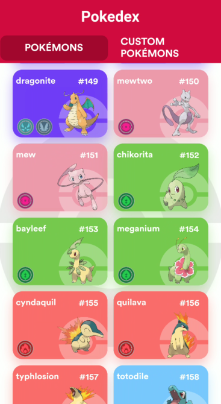
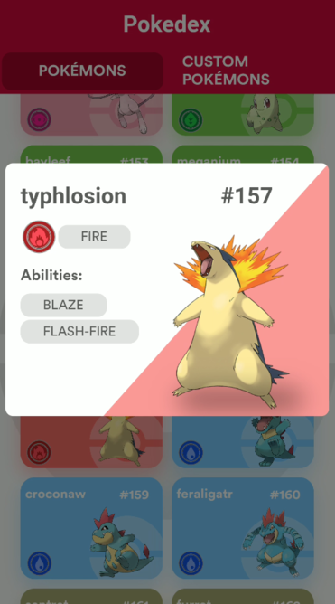
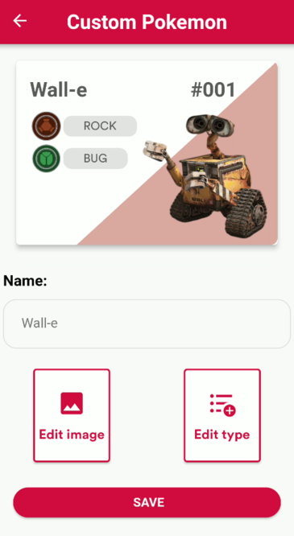
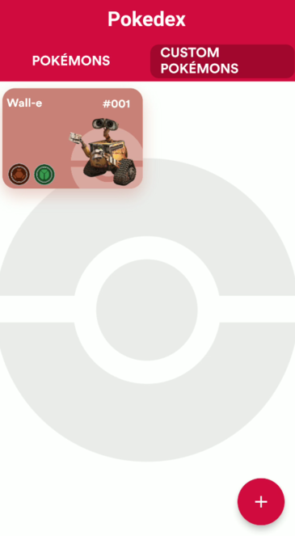

# Pokedex APP

 Um Pokedex feita com Flutter :)


# Features
## Vizualização de todos os Pokemons com Infite Scroll:




## Criação / Edição do seu próprio Pokemon:





# Arquitetura / Bibliotecas :

   - Banco de Dados -> Hive.

   - Clean Architecture com gerenciamento de estado com GetX.

   - Navegação e rotas -> GetX (Router Manager).

   - Modularização + Injeção de Dependencias -> GetX 


# Links para as inspirações do design:

   - <a href="https://dribbble.com/shots/6540871-Pokedex-App">Tela Inicial</a>
   - <a href="https://www.behance.net/gallery/137682969/Pokedex-Ui-Model?tracking_source=search_projects%7CPokedex">Tela Custom Pokemons / Pokemons Details </a>

## Como rodar?
### Modo 1 - EASY

Instalar este <a href="https://github.com/vitoriassia/variacao-do-ativo/blob/master/assets/app/app.apk">APK</a>  em seu celular android.

### Modo 2 - HARD rsrs 
 1-> Instalar o <a href="https://flutter.dev/docs/get-started/install">Flutter</a> na sua máquina.

 2-> E rodar o comando abaixo no diretório do projeto:
 
 ## Modo DEBUG
 ```console

foo@terminal:~$ flutter run -t 'lib/main.prod.dart'

```
## Modo RELEASE
```console

foo@terminal:~$ flutter run -t 'lib/main.prod.dart' --release

```

    
